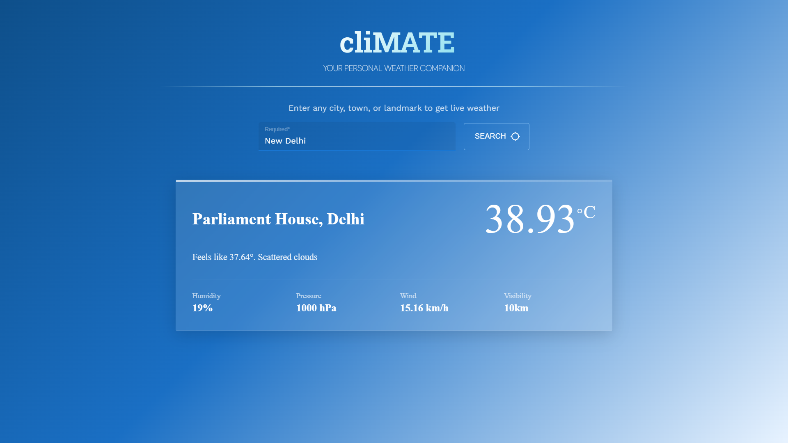
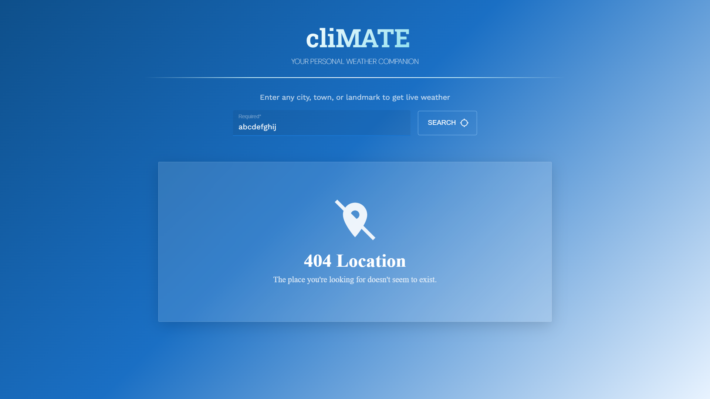

# ⛅ cliMATE

> A sleek, fast, and responsive weather application to keep you updated with the latest climatic conditions.

cliMATE is a modern weather web application that provides users with real-time weather data for any given location. Built with React and Vite, the platform integrates external APIs to fetch accurate weather statistics, delivering them through a clean and responsive Material UI interface.

---

## 📌 Overview

The platform allows users to:

* Search for real-time weather conditions of any city or location
* View detailed weather statistics including temperature, humidity, and more

---

## 📌 Features

* Modern UI/UX built with React and Material UI
* Fast and optimized development environment powered by Vite
* Geocoding integration to accurately map user-entered locations
* Real-time weather data fetching

---

## 🛠️ Tech Stack

**Frontend**
* React.js
* Vite
* CSS3 / Material UI (`@mui/material`)

**Tools & Services**
* OpenWeather API (Weather Data)
* Geoapify API (Geocoding)
* Dotenv (Environment variable management)

---

## 📸 Screenshots

### 🌍 Weather Search & Results

*Here are some previews of what the weather app shows when a location is specified:*

#### 🔹 Valid Location Result


#### 🔹 Invalid Location Result


---

## ⚠️ Note on Local Execution

> **Important:** To run this project locally, you must provide your own API keys for **OpenWeather** and **Geoapify**. Create a `.env` file in the root directory and add the following:
> ```env
> VITE_OPENWEATHER_API_KEY=your_openweather_api_key
> VITE_GEOAPIFY_API_KEY=your_geoapify_api_key
> ```

---

## 📁 Project Structure

```text
📦 cliMATE
├── 📁 public/                # Static assets
├── 📁 src/                   # Source files
│   ├── 📁 assets/            # Component-specific assets
│   ├── 📄 App.jsx            # Main React App component
│   ├── 📄 main.jsx           # React Entry point
│   ├── 📄 getWeather.jsx     # OpenWeather API integration logic
│   ├── 📄 geoCodeAddress.jsx # Geoapify API integration logic
│   ├── 📄 SearchForm.jsx     # Location search component
│   ├── 📄 WeatherCard.jsx    # Weather display components
│   └── 📄 ...                # Other React components and CSS files
│
├── 📄 .env                   # Environment variables (API Keys)
├── 📄 index.html             # Main HTML file
├── 📄 package.json           # Project dependencies
├── 📄 vite.config.js         # Vite configuration
└── 📄 README.md              # Project documentation
```

---

## 🔮 Future Improvements

* Forecast for the next 5-7 days
* User geolocation support (Auto-detect location)
* Dynamic backgrounds based on current weather conditions

---

## 👤 Author

**Anshumaan Sai Patnaik**

* GitHub:
  [Anshumaan Sai Patnaik GitHub](https://github.com/Anshumaan-Sai-Patnaik)

* LinkedIn:
  [Anshumaan Sai Patnaik LinkedIn](https://www.linkedin.com/in/Anshumaan-Sai-Patnaik)
